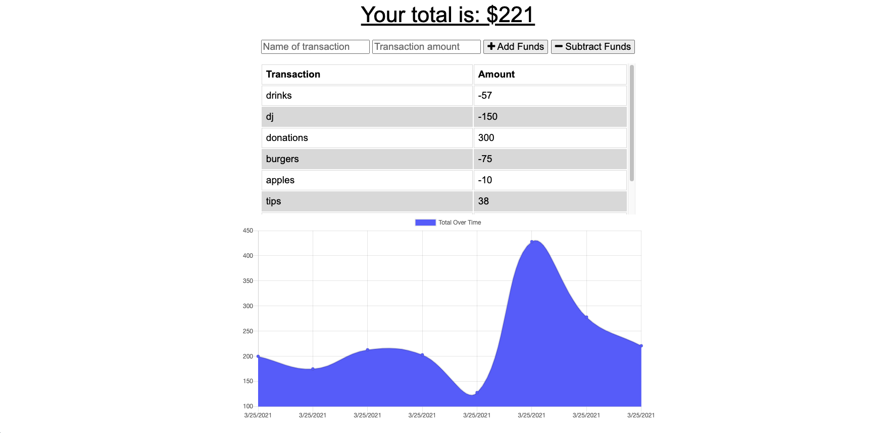

# progressiveBudgetTracker

# Unit 18 PWA Homework: Online/Offline Budget Trackers
  

  # **Description**
  * For this assignment,I created a budget tracker. I was provided with the front end code in the `Develop` folder. Add functionality to our existing Budget Tracker application to allow for offline access and functionality.
  The user will be able to add expenses and deposits to their budget with or without a connection. When entering transactions offline, they should populate the total when brought back online.

    

  # ** Table of Contents**
  1. [Description](#Description)
  2. [Screenshots](#Screenshots)
  3. [Dependencies](#Dependencies)
  4. [Application](#Application)
  5. [Contributors](#Contributors)
  6. [FAQ](#FAQ)
  
  
  
  

  # **Screenshots**
   
  

 
  # **Dependencies**
  List of required installations prior to download if you would like to work with code from portfolio projects.

  Install the following:

   * npm init

  Run Application:
   * node server.js

  Varying between the applications, I install the following packages:

    * npm install express
    * npm install mongoose
    * npm install morgan
    * npm install lite-server
    * npm install compression
  

 Requirements:
   * Install latest version of Mongo and Robo 3T

  
  
  # **Application**
  
  * Link to Application: 
  * Github Repo: https://github.com/Franciscorosado09/progressiveBudget
  
  # **Contributors**
  Author of README Francisco E. Rosado

  *  GW for Starter code
  * Additionsl sources: Stackoverflow, GW lessons
  * Feedback, brainstorming, and general support to study group:

        1. Young Ji Kim - https://github.com/youjmi
        2. Amir Ashtiany - https://github.com/Alexfit4
        3. Johnnie Simpson - https://github.com/balokdecoy
        4. Rachel Wanke - https://github.com/rwanke14
    
  
  # **FAQ**
  Contact info:

    * README Author: Francisco E. Rosado

    * Email: Franciscorosado09@gmail.com

    * Github Repo ID: Franciscorosado09

  
  
  